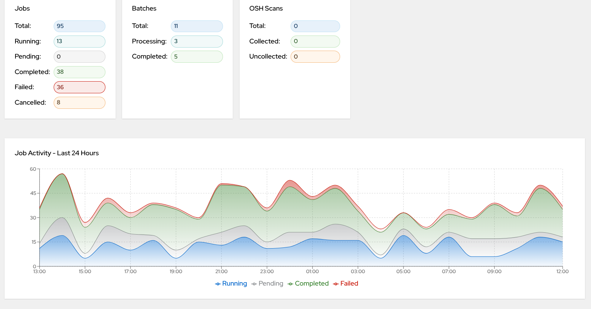
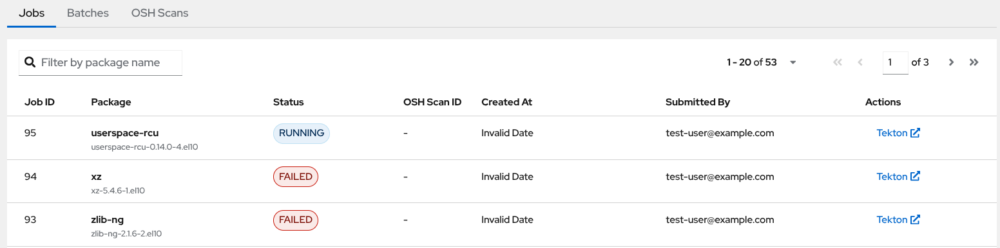
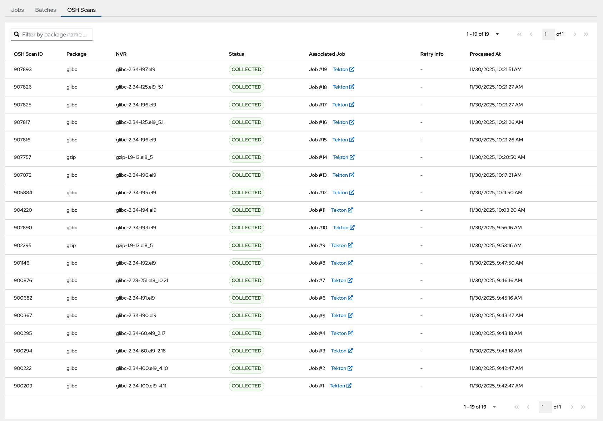

# SAST AI Monitoring Dashboard

Real-time monitoring dashboard for [SAST AI Orchestrator](https://github.com/RHEcosystemAppEng/sast-ai-orchestrator) with WebSocket updates.

## Prerequisites

### For Local Development
- **Node.js 18+** and npm
- **SAST AI Orchestrator** running (default: http://localhost:8080)

### For Deployment
- **Docker** (for containerized deployment)
- **Helm 3** (for Kubernetes/OpenShift deployment)
- **oc** or **kubectl** CLI (for cluster access)
- Access to container registry (Quay.io for CI/CD)

## Screenshots

### Dashboard Overview


The dashboard provides a comprehensive view with:
- **Summary Cards**: Real-time statistics for Jobs, Batches, and OSH Scans
- **Job Activity Graph**: 24-hour timeline showing job status trends (Running, Pending, Completed, Failed)

### Jobs Table


The Jobs view features:
- **Filterable table** with job details (ID, package, status, timestamps)
- **Status indicators** with color-coding (Running, Completed, Failed, etc.)
- **Actions column** with links to Tekton pipelines
- **Pagination** for large datasets

### OSH Scans Table


The OSH Scans view displays:
- **Scan details** including hash IDs, accounts, etc.
- **Status tracking** (Collected/Uncollected)
- **Processing timestamps**

## Quick Start

```bash
# Install dependencies
npm install

# Create environment configuration (local/OCP endpoints)
cat > .env << 'EOF'
REACT_APP_ORCHESTRATOR_API_URL=http://localhost:8080/api/v1
REACT_APP_WS_URL=ws://localhost:8080/ws/dashboard
EOF

# Start development server
npm start

# Open browser at http://localhost:3000
```

## Configuration

The application supports a **two-tier configuration strategy** to enable runtime configuration in containerized environments:

### 1. Build-time Configuration (Local Development)

Create a `.env` file in the project root:

```bash
# Orchestrator REST API URL
REACT_APP_ORCHESTRATOR_API_URL=http://localhost:8080/api/v1

# Orchestrator WebSocket URL
REACT_APP_WS_URL=ws://localhost:8080/ws/dashboard
```

These values are embedded into the JavaScript bundle during `npm build`.

### 2. Runtime Configuration (Kubernetes/OpenShift)

In production, configuration is provided via a **Kubernetes ConfigMap** that generates `/env-config.js`:

```javascript
window._env_ = {
  REACT_APP_ORCHESTRATOR_API_URL: 'https://orchestrator.example.com/api/v1',
  REACT_APP_WS_URL: 'wss://orchestrator.example.com/ws/dashboard'
};
```

**Benefits:**
- Same Docker image works across all environments
- No rebuild required for configuration changes
- Update ConfigMap → Helm upgrade → Pods auto-restart

**Configuration in Helm:**
Edit `deploy/frontend-chart/values.yaml`:
```yaml
app:
  env:
    REACT_APP_ORCHESTRATOR_API_URL: "https://your-orchestrator-url/api/v1"
    REACT_APP_WS_URL: "wss://your-orchestrator-url/ws/dashboard"
```

## Development

```bash
# Start development server (hot reload enabled)
npm start

# Run tests
npm test

# Run tests with coverage
npm test -- --coverage

# Build for production
npm run build
```

### Development Server

- Opens at: **http://localhost:3000**
- Connects to orchestrator at: **http://localhost:8080** (configurable via `.env`)
- Hot reload enabled (changes reflect immediately)
- DevTools console shows WebSocket messages

## Deployment

### Container Build & Run

#### Build Container Image

The project includes a multi-stage Containerfile using Red Hat UBI images:

```bash
# Build the image
docker build -t sast-ai-frontend:latest .

# Run locally
docker run -p 8080:8080 sast-ai-frontend:latest

# Access at http://localhost:8080
```

**Container Image Details:**
- Base: Red Hat UBI 9 with Nginx
- Non-root user (UID 1001) for OpenShift compatibility
- Port: 8080
- Health check: `/healthz`

#### Automated CI/CD

Pushes to `main` branch trigger GitHub Actions:
1. Build Docker image using Buildx
2. Push to `quay.io/ecosystem-appeng/sast-ai-frontend:latest`
3. Deploy manually using Helm

### OpenShift/Kubernetes Deployment

#### Using Makefile (Recommended)

```bash
cd deploy

# First-time deployment
make deploy

# Upgrade existing deployment
make upgrade

# Check deployment status
make status

# Get frontend URL
make url

# View pod logs
make logs

# Rollback to previous version
make rollback

# Remove deployment
make clean
```

#### Using Helm Directly

```bash
cd deploy/frontend-chart

# Install
helm install sast-ai-frontend . -n sast-ai-dev

# Upgrade
helm upgrade sast-ai-frontend . -n sast-ai-dev

# Uninstall
helm uninstall sast-ai-frontend -n sast-ai-dev
```

#### Health Checks

The deployment includes Kubernetes health probes:

- **Liveness Probe**: `GET /healthz` every 10s (starts after 10s)
- **Readiness Probe**: `GET /healthz` every 5s (starts after 5s)

#### OpenShift Route Features

- **TLS**: Automatic edge termination (HTTPS)
- **WebSocket**: Supported with 1-hour timeout
- **Hostname**: Auto-generated based on cluster domain

### Build for Production

```bash
# Create optimized production build
npm run build

# Output directory: build/
# Contains static HTML, CSS, JS files ready for deployment
```

**Build artifacts are automatically included in Docker image.**

## Testing WebSocket Connection

Open browser DevTools Console to see WebSocket messages:

```
WebSocket connected
WebSocket message: { type: 'job_status_change', data: {...} }
```

## Architecture

The dashboard follows a centralized state management pattern with real-time updates:

**1. Initial Load (REST API):**
```
DashboardContext → orchestratorApi.getJobs() → Update state
DashboardContext → orchestratorApi.getBatches() → Update state
DashboardContext → orchestratorApi.getOshScans() → Update state
DashboardContext → orchestratorApi.getDashboardSummary() → Update state
DashboardContext → orchestratorApi.getJobActivity24h() → Update state
```

**Additional API Methods Available:**
- `getJobById(jobId)` - Fetch individual job details
- `getBatchById(batchId)` - Fetch individual batch details
- `getOshStatus()` - Fetch OSH status
- `getHealth()` - Health check endpoint

**2. Real-time Updates (WebSocket):**
```
Orchestrator → ws://dashboard → DashboardContext → Update state → Components re-render
```

WebSocket includes automatic reconnection with exponential backoff (max 10 attempts) and ping/pong keepalive every 30 seconds.

**3. State Management:**

DashboardContext provides:
- `jobs` - Array of job objects
- `batches` - Array of batch objects
- `oshScans` - Array of OSH scan objects
- `summary` - Dashboard summary metrics
- `jobActivity` - 24-hour job activity statistics
- `loading` - Loading state indicator
- `error` - Error state
- `refetchAll()` - Manual data refresh method

**4. State to UI:**
```
DashboardContext.jobs → JobsTable
DashboardContext.batches → BatchesTable
DashboardContext.oshScans → OshScansTable
DashboardContext.summary → SummaryCards
DashboardContext.jobActivity → JobActivityGraph (24-hour activity chart)
```

### WebSocket Messages

The dashboard handles these message types:

| Message Type | Description | Action |
|--------------|-------------|--------|
| `connected` | Confirmation of WS connection | Log to console |
| `pong` | Keepalive response | Reset connection timer |
| `job_status_change` | Job status updated | Update job in table |
| `batch_progress` | Batch progress updated | Update batch progress bar |
| `osh_scan_collected` | OSH scan converted to job | Add new job to table |
| `osh_scan_failed` | OSH scan failed | Log warning |
| `summary_update` | Summary metrics updated | Update summary cards |

## Technology Stack

| Package | Version | Purpose |
|---------|---------|---------|
| **React** | 18.3.1 | UI framework |
| **TypeScript** | 4.9.5 | Type safety |
| **PatternFly React Core** | 5.4.14 | UI components |
| **PatternFly React Table** | 5.4.16 | Data tables |
| **PatternFly React Icons** | 5.4.2 | Icons |
| **PatternFly CSS** | 5.4.2 | Styling |
| **Recharts** | 2.12.7 | Charting library for activity graphs |
| **React Router DOM** | 6.30.1 | Client-side routing |
| **Axios** | 1.13.0 | HTTP client |
| **React Scripts** | 5.0.1 | Build tooling |

## Manual Testing

1. **Start orchestrator**:
   ```bash
   cd ../sast-ai-orchestrator
   ./mvnw quarkus:dev
   ```

2. **Start dashboard**:
   ```bash
   npm start
   ```

3. **Verify UI Components** (see [Screenshots](#screenshots) section for visual reference):
   - Dashboard loads at http://localhost:3000
   - Connection indicator shows "Live" (green)
   - Summary cards display metrics ([Dashboard Overview](docs/screenshots/dashboard-overview.png))
   - Jobs table shows data ([Jobs Table](docs/screenshots/jobs-table-view.png))
   - Batches table shows data
   - OSH Scans tab displays scan data ([OSH Scans Table](docs/screenshots/osh-scans-table.png))
   - Job Activity Graph shows 24-hour activity chart ([Dashboard Overview](docs/screenshots/dashboard-overview.png))

4. **Test WebSocket**:
   - Open DevTools Console
   - Look for: `WebSocket connected`
   - Trigger job status change in orchestrator
   - Watch tables update in real-time

## Links

- [PatternFly React Documentation](https://www.patternfly.org/components/all-components)
- [WebSocket API Documentation](https://developer.mozilla.org/en-US/docs/Web/API/WebSocket)
