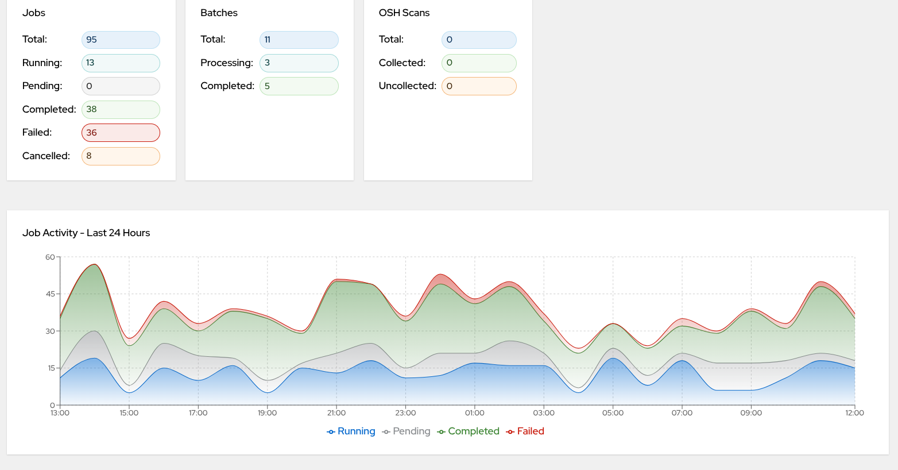
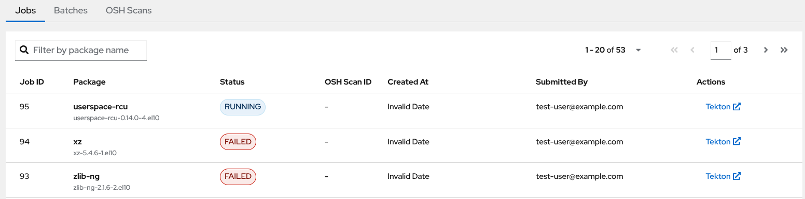
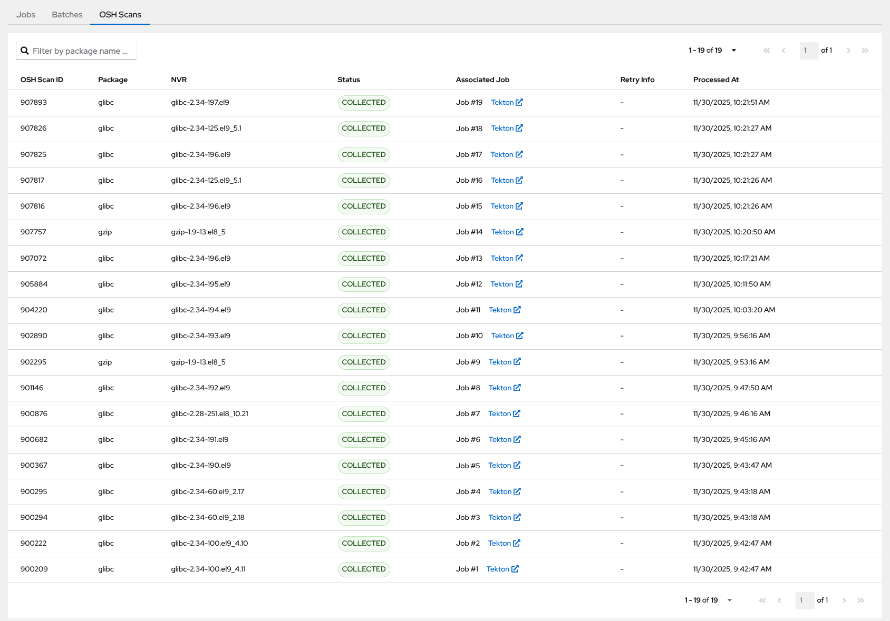

# SAST AI Monitoring Dashboard

[](https://github.com/RHEcosystemAppEng/sast-ai-frontend/actions/workflows/build-dev-image.yml)
[](https://github.com/RHEcosystemAppEng/sast-ai-frontend/actions/workflows/build-release-image.yml)
[](https://quay.io/repository/ecosystem-appeng/sast-ai-frontend)

A real-time monitoring dashboard for tracking SAST (Static Application Security Testing) jobs, batches, and OSH scans processed by the [SAST AI Orchestrator](https://github.com/RHEcosystemAppEng/sast-ai-orchestrator).

## Features

- **Live Dashboard** — Real-time metrics for jobs, batches, and scans with auto-updating summary cards
- **WebSocket Updates** — Instant UI updates when job statuses change (no manual refresh needed)
- **Job Activity Graph** — 24-hour timeline visualization of job status trends
- **Filterable Tables** — Search and paginate through jobs, batches, and OSH scans
- **Tekton Integration** — Direct links to pipeline runs for each job

## Quick Start

**Prerequisites:** Node.js 18+ and npm

```bash
npm install

# Configure environment
cp .env.example .env
# Edit .env with your orchestrator URLs

npm start
# Open http://localhost:3000
```

## Screenshots



<details>
<summary>More screenshots</summary>

**Jobs Table**


**OSH Scans Table**


</details>

## Development

```bash
npm start              # Dev server with hot reload
npm test               # Run tests
npm run build          # Production build
```

## Configuration

Create a `.env` file:

```bash
REACT_APP_ORCHESTRATOR_API_URL=http://localhost:8080/api/v1
REACT_APP_WS_URL=ws://localhost:8080/ws/dashboard
```

## Tech Stack

React 18 • TypeScript • PatternFly 5 • Recharts • Axios

## Documentation

| Document | Description |
|----------|-------------|
| [Deployment Guide](docs/DEPLOYMENT.md) | Kubernetes/OpenShift deployment, Helm, health checks |
| [Architecture](docs/ARCHITECTURE.md) | Internal architecture, WebSocket messages, state management |
| [Release Management](docs/RELEASE.md) | CI/CD pipelines, versioning, production releases |
| [Contributing](docs/CONTRIBUTING.md) | How to contribute to this project |

## Links

- [SAST AI Orchestrator](https://github.com/RHEcosystemAppEng/sast-ai-orchestrator)
- [PatternFly Documentation](https://www.patternfly.org/components/all-components)
- [Container Registry (Quay.io)](https://quay.io/repository/ecosystem-appeng/sast-ai-frontend)

## License

See [LICENSE](LICENSE) file.
